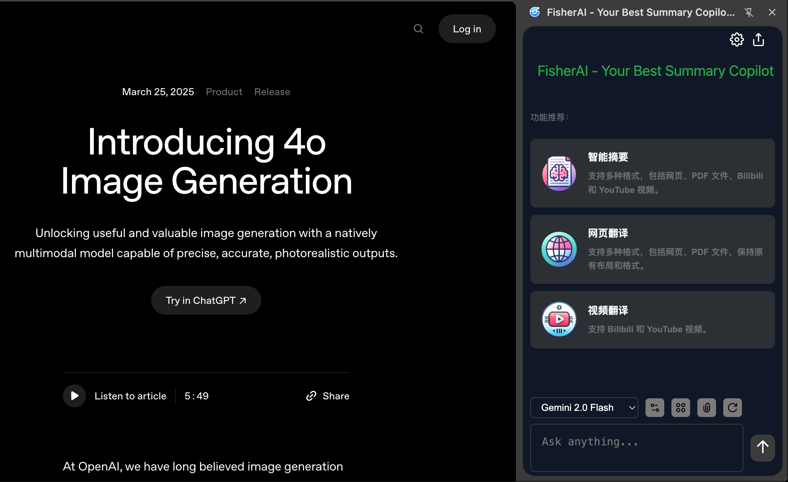
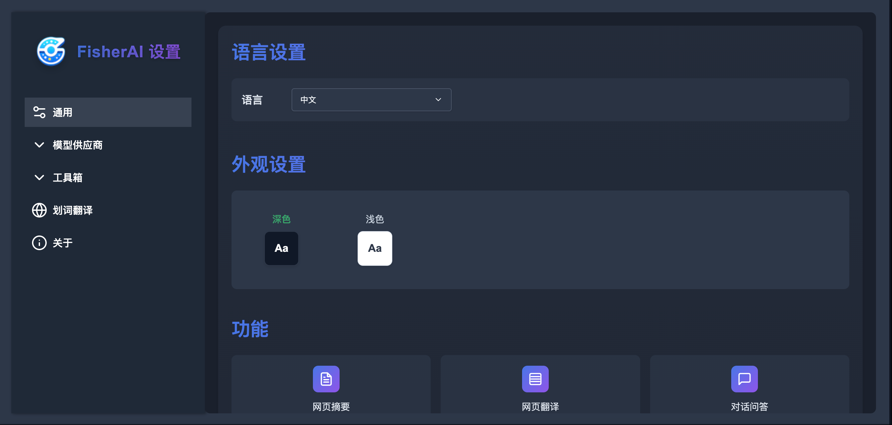
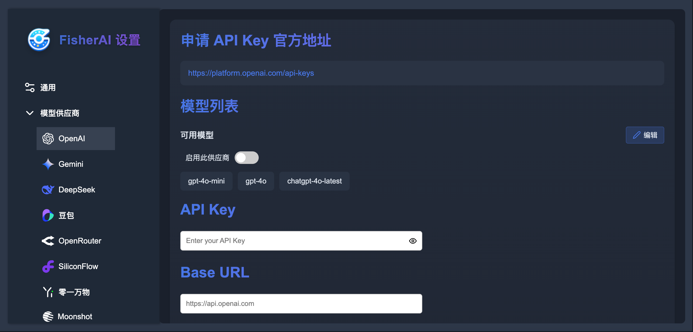
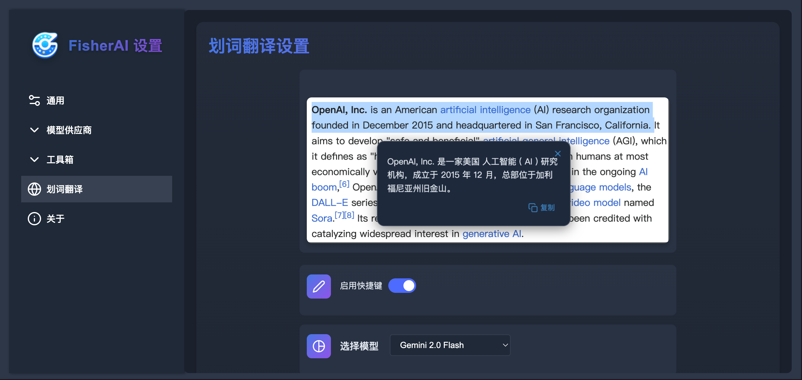

<div align="center">
    <h1>FisherAI - Your Best Summary Copilot</h1>
    <p>🚀 强大的 Chrome AI 助手，让网页浏览更智能</p>
    <p>
        <a href="https://chromewebstore.google.com/detail/fisherai-your-best-summar/ipfiijaobcenaibdpaacbbpbjefgekbj">
            
        </a>
        
    </p>
</div>

## 📖 简介

FisherAI 是一款强大的 Chrome 插件，专注于提升您的网页浏览和学习体验。支持多种顶级 AI 模型，包括 OpenAI、Gemini、Deepseek、OpenRouter、SiliconFlow、Doubao、Mistral、Groq、Yi、Moonshot、Ollama 等。

### ✨ 主要特性

- 🔍 **智能摘要** - 一键生成网页/视频的内容摘要
- 🌍 **智能翻译** - 支持网页和视频字幕翻译
- 🤖 **多模型支持** - 集成主流大语言模型，可自定义 API
- 🆓 **内置免费模型** - 预置多个高性能免费模型，无需配置即可使用
- 💬 **多轮对话** - 智能上下文理解，连续对话交互
- 🛠️ **实用工具集** - 内置 SerpApi 搜索、DALLE-3 绘图等工具

## 🖼️ 界面预览

<div align="center">
    
</div>
<br/>
<div align="center">
    
</div>
<br/>
<div align="center">
    
</div>
<br/>
<div align="center">
    
</div>
<br/>
<div align="center">
    
</div>
<br/>


## 🚀 快速开始

### 安装方式

1. [Chrome 应用商店安装](https://chromewebstore.google.com/detail/fisherai-your-best-summar/ipfiijaobcenaibdpaacbbpbjefgekbj)（推荐）
2. 下载源码本地安装：
   - 下载源码：`git clone https://github.com/fisherdaddy/FisherAI.git`
   - 打开 Chrome 扩展管理页面 (输入：`chrome://extensions/`)
   - 开启"开发者模式"
   - 点击"加载已解压的扩展程序"，选择解压目录

### Ollama 本地模型配置

1. 启动 Ollama 服务（需开启跨域支持）：
```bash
OLLAMA_ORIGINS=* ollama serve
```

2. 插件配置：
   - 打开插件设置
   - 在 Ollama 配置项中输入服务地址（默认：`http://127.0.0.1:11434`）
   - 测试连接并保存
   - 刷新后即可使用本地模型（模型名以 -ollama 结尾）

> 提示：可通过访问 `http://127.0.0.1:11434/api/tags` 验证 Ollama 服务状态

## 📝 更新日志

### 2025-04-13
- ✨ **支持更多模型供应商**: 支持更多模型供应商，如 OpenAI、Gemini、xAI、OpenRouter、Siliconflow、DeepSeek、Doubao 等。
- ✨ **支持自定义 Prompt**: 支持自定义 Prompt，支持多种场景的 Prompt 设置。
- 🚀 **支持浅色模式和黑色模式**
- 🚀 **体验改进**: 优化快捷翻译展示界面

### 2025-02-10
- ✨ **新增模型支持**: 集成 DeepSeek-R1、Gemini-2.0-flash 等先进模型。
- ✨ **公式渲染**: 添加对 LaTeX 公式的渲染支持。
- 🚀 **Ollama 优化**: 改进 Ollama 本地模型的使用体验。

### 2024-07-17
- ✨ **工具箱**: 新增工具箱功能，扩展插件能力。
- ✨ **自定义参数**: 允许用户自定义模型参数（如温度、Top P 等）。
- ✨ **Ollama 集成**: 初步集成 Ollama，支持本地模型。

### 2024-05-19
- ✨ **网页翻译**: 新增网页全文翻译功能。
- ✨ **视频翻译**: 新增对 Bilibili 和 YouTube 视频字幕的翻译功能。
- ✨ **模型扩展**: 增加对多种主流 AI 模型的支持。
- ✨ **划词翻译**: 实现划词翻译功能。
- ✨ **文件上传**: 支持上传图片和常见文件。
- ✨ **快捷命令**: 输入框支持 `/` 触发快捷功能。
- 🚀 **设置页改版**: 重新设计和优化设置页面。

### 2024-04-17
- ✨ **智能摘要**: 实现一键自动摘要功能。
- ✨ **自定义 API Key**: 支持用户配置自定义 OpenAI API 密钥。
- ✨ **多轮对话**: 添加多轮对话功能。
- ✨ **分享功能**: 新增将摘要结果分享为图片的功能。

## 📜 开源协议

本项目遵循 Apache 2.0 协议。详见 [LICENSE](LICENSE) 文件。

## 🤝 贡献指南

欢迎提交 Issue 和 Pull Request！

## ⭐ 支持项目

如果这个项目对您有帮助，请考虑给它一个 Star！
