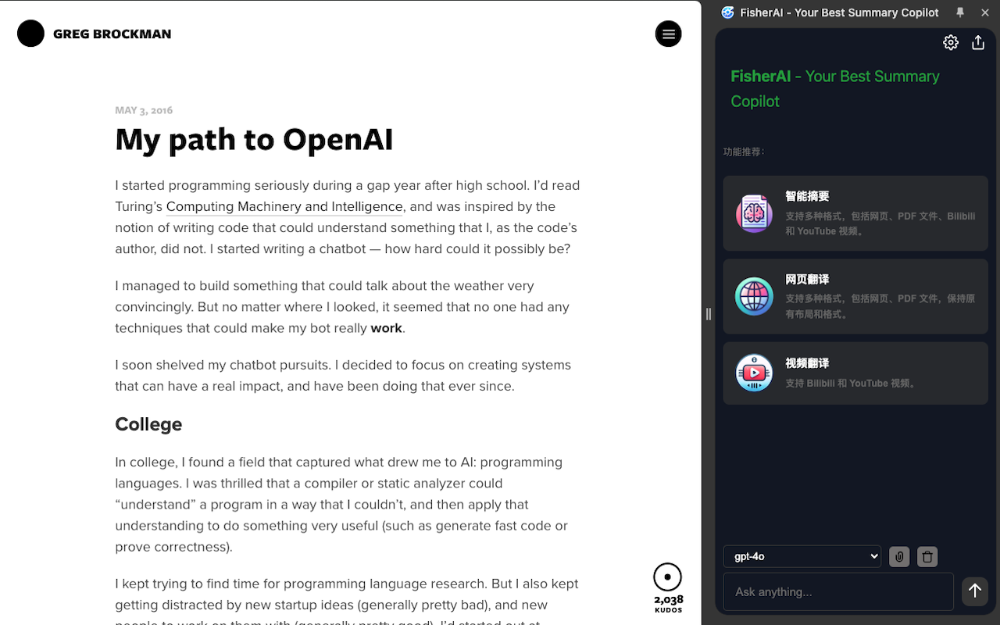
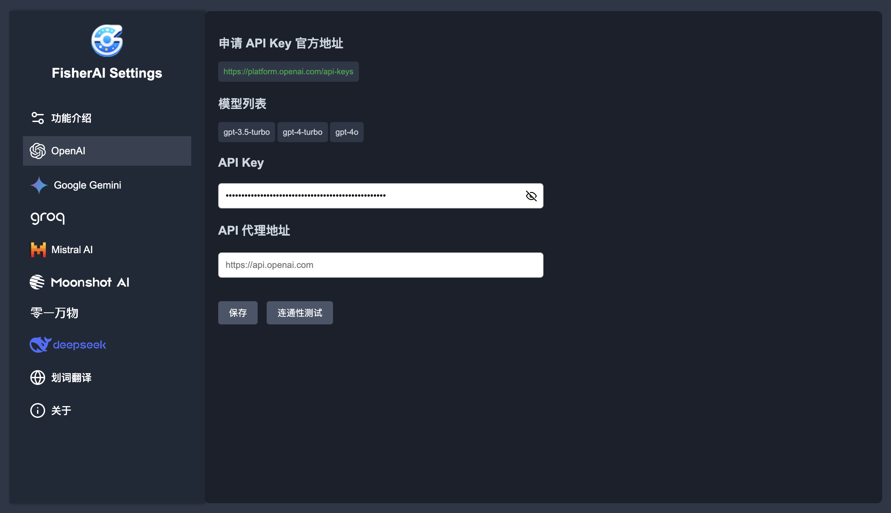

<div align="center">
    <h1>FisherAI - Your Best Summary Copilot</h1>
    <p>🚀 强大的 Chrome AI 助手，让网页浏览更智能</p>
    <p>
        <a href="https://chromewebstore.google.com/detail/fisherai-your-best-summar/ipfiijaobcenaibdpaacbbpbjefgekbj">
            
        </a>
        
    </p>
</div>

## 📖 简介

FisherAI 是一款强大的 Chrome 插件，专注于提升您的网页浏览和学习体验。支持多种顶级 AI 模型，包括 GPT、Azure、Gemini、Deepseek、Mistral、Groq、Yi、Moonshot 等。

### ✨ 主要特性

- 🔍 **智能摘要** - 一键生成网页/视频的内容摘要
- 🌍 **智能翻译** - 支持网页和视频字幕翻译
- 🤖 **多模型支持** - 集成主流大语言模型，可自定义 API
- 🆓 **内置免费模型** - 预置多个高性能免费模型，无需配置即可使用
- 💬 **多轮对话** - 智能上下文理解，连续对话交互
- 🛠️ **实用工具集** - 内置 SerpApi 搜索、DALLE-3 绘图等工具

## 🖼️ 界面预览

<div align="center">
    
    <br/>
    
</div>

## 🚀 快速开始

### 安装方式

1. [Chrome 应用商店安装](https://chromewebstore.google.com/detail/fisherai-your-best-summar/ipfiijaobcenaibdpaacbbpbjefgekbj)（推荐）
2. 下载源码本地安装：
   - 下载并解压源代码
   - 打开 Chrome 扩展管理页面 (`chrome://extensions/`)
   - 开启"开发者模式"
   - 点击"加载已解压的扩展程序"，选择解压目录

### Ollama 本地模型配置

1. 启动 Ollama 服务（需开启跨域支持）：
```bash
OLLAMA_ORIGINS=* ollama serve
```

2. 插件配置：
   - 打开插件设置
   - 在 Ollama 配置项中输入服务地址（默认：`http://127.0.0.1:11434`）
   - 测试连接并保存
   - 刷新后即可使用本地模型（模型名以 -ollama 结尾）

> 提示：可通过访问 `http://127.0.0.1:11434/api/tags` 验证 Ollama 服务状态

## 📝 更新日志

### 2025-02-10
- ✨ 集成 DeepSeek-R1、Gemini-2.0-flash 等顶尖模型
- 🔢 支持 LaTeX 公式渲染
- 🛠️ 优化 Ollama 使用体验

### 2024-07-17
新增功能和改进包括：
- 工具箱
- 自定义模型参数
- Ollama

### 2024-05-19
新增功能和改进包括：
- 网页翻译
- 视频翻译
- 支持常见模型
- 划词翻译
- 上传图片和文件
- 输入/触发快捷功能
- 设置页改版与优化

### 2024-04-17
新增功能和改进包括：
- 一键自动摘要
- 自定义OpenAI API密钥
- 多轮对话功能
- 分享功能

## 📜 开源协议

本项目遵循 Apache 2.0 协议。详见 [LICENSE](LICENSE) 文件。

## 🤝 贡献指南

欢迎提交 Issue 和 Pull Request！

## ⭐ 支持项目

如果这个项目对您有帮助，请考虑给它一个 Star！
